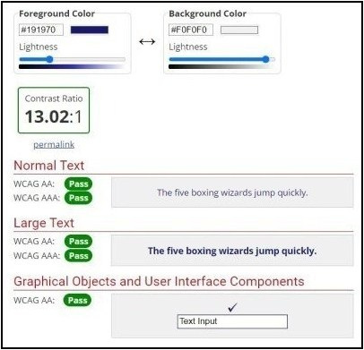

# La Boulangerie

[View the live website here](https://michellegri.github.io/la-boulangerie/)

[GitHub Repo](https://github.com/MichelleGri/la-boulangerie)

***

## About

The La Boulangerie website is based on a fictional bakery business in London. The website’s overall goal is to attract customers to the bakery and to make sales through online ordering. It aims to highlight the unique selling points of the bakery, make ordering easy and convenient, attract new customers, and encourage loyalty among existing customers. 
La Boulangerie began operating in 1998 and is an independent family-run bakery. It sells breads, sweet and savoury baked goods, desserts, cakes, and cold and hot drinks. The bakery prides in providing distinctly tasty food and beverages made from secret family recipes.
The target customers for the bakery are people looking for a wide variety of delicious freshly baked food in a single bakery, made from quality ingredients. Customers have the option to either ‘take away’ their order or there is seating available for customers who want to enjoy their food and/or beverages in the tranquil environment of the bakery. There is also an option to place orders online through popular delivery services – UberEats, Deliveroo, and Just Eat. To add convenience, a ‘click and collect’ service is also available, where customers are able to place orders online and collect it at the bakery.
The website provides a brief introduction to the bakery; information regarding the wide range of products available and prices; ways to order online; social media links; the bakery’s location, contact information (phone number, email address, and a form to send messages), and the business opening and closing days and times.

***

## Index - Table of Contents

* [User Experience (UX)](#user-experience) 
* [Features](#features)
* [Designs](#designs)
* [Technologies Used](#technologies-used)
* [Testing](#testing)
* [Known Bugs](#known-bugs)
* [Deployment](#deployment)
* [Acknowledgements](#credit)

***

## User Experience (UX)

## Strategy
### User Stories

#### Reasons to visit the website

* A user looking for more information regarding the products sold by the bakery and their prices.
* A user wanting to place an order online for delivery or collection.
* A user looking to find out more about the bakery’s ambience and environment.
* A user looking for the bakery’s location.
* A user looking for the opening and closing days and times of the bakery. 
* A user wanting to send a message or provide feedback relevant to the bakery.

#### Aims of the website

* Increase customers
* Inform customers 
* Maintain loyalty among existing customers through encouraging repeat purchase
* Provide information regarding the products sold at the bakery and their prices
* Provide information for bakery location
* Provide information for bakery operating days and hours 
* Provide information to contact the bakery
* Provide information for the bakery’s social media pages

## Scope

#### User expectations
* Being able to easily navigate through the website
* Being able to easily place orders online
* Being able to easily find the menu and price list
* Visually appealing on different screen sizes
* Functions and links to be working as expected
* Information about La Boulangerie bakery
* Contact information, location, and business operating days and times
* Find links to social media pages
* Special promotional offers and discounts

#### First Time Visitor Goals
* To be able to understand the primary purpose of the website and learn about the business.
* To be able to easily place an order for delivery or collection.
* To be able to easily navigate through the website and find content. 
* To be able to easily find a list of all products offered at the bakery and their prices. 
* To be able to find the location and operating days and times of the bakery.

#### Returning Visitor Goals
* To be able to find and view the menu easily and quickly.
* To be able to easily place orders online for delivery or collection.
* To be able to find business operating days and hours.
* To be able to contact the bakery through the contact us form and provide feedback and/or ask questions. 

#### Frequent User Goals
* Sign up for special promotional offers and discounts.
* Create customer account to easily place orders online.

#### As a developer / business, I want to provide
* A simple and easy to navigate website with all functions and links working as expected
* A comprehensive menu with prices
* Information regarding the bakery
* Photos of the bakery and the products sold
* An easy way to contact the bakery
* Information regarding the bakery location and business operating days and hours
* Links to social media pages

## Structure
The website consists of 4 separate pages
* A homepage with a hero-image, a brief about-us section, and a menu section
* A menu page with a list of products and their prices, and links to online ordering options
* A gallery page with photos of inside of the bakery and its products
* A contact us page with a form, a map, address, phone number, and email address for the bakery

***

## Designs

## Surface

#### Colour Scheme
The site was created with a very simple colour scheme of shades of blues and greys. It was important to use subtle colours on the site as the images are bright and vibrant. This ensures that the user is not overwhelmed by many and contrasting colours. A colour picker was used on this specific part of the hero image to select the colours:

Four colours were chosen for the colour palette using the website www.canva.com/colors. 

Midnight blue (#191970) – this colour is used for the logo and to highlight certain phrases on the about-us section. It is also used for the box-shadow effect on the ‘Order Online’ button. 
Grape (#494454) – this colour is used for text on the site. 
Light blue-grey (#CDDEEE) – this colour is used for the footer background, and the ‘Order Online’ button background. 
White Smoke (#F0F0F0) – this colour is used for background of the whole site. 
The suitability of these colours for accessibility and readability purposes was checked using contrast checker tool on https://webaim.org/resources/contrastchecker/. 

The main background colour (#F0F0F0) was checked against the main text colour (#494454).

The main background colour (#F0F0F0) was checked against the logo and emphasised text colour (#494454).

The footer and 'Order Online' button background colour (#CDDEEE) was checked against the main text colour (#494454).

#### Typography

Three fonts were imported from Google Fonts into the style.css file. These include 'Shadows Into Light', 'Poppins', and 'Manrope'.

Shadows Into Light – this font was used for the bakery Logo only. This font aims to add style and distinctiveness to the bakery logo. 

Poppins – this font has been used for all headings on the website.

Manrope – this font has been used for all other text on the website.

Manrope and Poppins were chosen for headings and other text as they compliment each other and are easily readable. 

Letter spacing has been included to almost all text to increase readability of the text. 

All fonts have been set to default to sans-serif in case they are unable to load or be applied to the text. 

A variety of font sizes have been used throughout the website to ensure text is in proportion to other elements on the page, such as images. 

## Features

### Existing Features

### Homepage

#### Navigation Bar
The navigation bar appears on all four pages of the website. This enables the user to easily move between pages without having to use the ‘back’ function. The navigation bar includes the bakery logo of the left side of the page, which returns to user to the homepage when clicked. The other four links included on the navigation bar are: Home, Menu, Gallery, and Contact Us. The navigation bar is responsive on multiple screen sizes, and it moves to under the logo on small screen, such as mobile devices. Although ‘Menu’ is included in the navigation bar, this page has not yet been created. 

#### Landing Page image
The landing page image is a photo of four cupcakes lined up horizontally. It aims to capture the visitors attention and encourage them to investigate further. The vibrant yet subtle colours on the main image, set against a light grey background colour, intend to entice the user to visit the bakery. The fruit on the main image gives the impression of freshness and well-being. 

#### About Us section
Set in the middle of the page, this section aims to provide a little information regarding the bakery. 
It is further sectioned into two parts - an image of the bakery on the right, and some text about the bakery on the left. 
The section informs the user that the bakery is based in London and began operating in 1998. The ‘cakes and croissants’ and ‘sweet and savoury’ words have been highlighted in blue (the company logo colour) to place emphasis that the bakery is able to cater for the needs of people wanting to consume either sweet or salty baked goods. 
The bakery image on the right is a watercolour painting of the bakery from the outside. This aims to give a character and sense of ‘old-fashioned’ heritage. 

#### Bakery Menu section
The bakery menu is located at the bottom of the landing page. It presents four images of different types of products sold at La Boulangerie: Breads and Savouries, Sweets and Desserts, Cakes, and Drinks. The idea is to link each image to the relevant part of the section of the main bakery Menu page. Although this section is included, the ‘Menu’ page has not yet been created. Therefore, currently the link leads to the top of the homepage. There is a hover effect that includes the names of the categories set on white background with an opacity so that the image below is slightly visible on hover. 

#### Footer
The footer is featured on all four pages of the website. It is identical on all pages and appears at the bottom of the page. There are three sections included within the footer:

* Opening Times – this section gives information regarding the business opening and closing days and times. This is important as customers need to be aware of when to visit the bakery. 

* Contact Us – this section lists the bakery phone number, address, and email address. Along with providing the bakery address, this section gives the users two options on how to contact the bakery – a phone number and email. 

* Social Media – this part of the footer provides links to the bakery’s social media platforms – Facebook, Twitter, and Instagram. This encourages the user to stay connected and interact with the company. These pages enable the business to advertise the bakery and announce promotional offers, discounts, and events. The social media icons are clickable links to the relevant page which opens in a new tab.  As La Boulangerie is a fictional business, the links currently lead to the website homepage.

## Gallery Page

The gallery page includes 14 photos relevant to the bakery, presented in a masonry style. This pages aims to give the user an idea of the bakery’s ambience and the products sold. It’s purpose is to convince the user to visit the bakery and have an enjoyable experience. The user is able to visualise the bakery and therefore set their expectations accordingly. 

## Contact Us Page
The contact us page includes two panels. The left panel enables the user to complete a short and simple form with their name and contact details, and to send a message to the company. The right panel includes details of how to find the bakery.

### Contact Page - 'Contact Us'

There is also a question that allows the user to either opt-in or opt-out to the mailing list to receive email newsletters, offers and vouchers. The name, phone number, and email address inputs are set to required so that the user is unable to send the message unless these fields have been completed. The message/feedback input field is set to optional. By default, the option to opt-in or opt-out of the mailing list is set to ‘No’. This is to avoid anyone being accidently added to the mailing list if they do not wish to do so. Sending a message will result in the user being informed that their message has been sent and someone will be in contact with them shortly. However, as this website is for educational purposes only, submitting a message currently leads to the formdump.codeinstitute.net page. 

### Contact Page – ‘How to Find Us’
The ‘How to Find Us’ panel is on the right side of the page and includes a google map of the bakery’s location, the bakery address, phone number, and email address. The map includes a ‘View larger map’ link that opens in a new tab where the user can input their own postcode to receive travel instructions to the bakery.

### Features that can be added in the future

#### Company History
A ‘Company History’ page can be included to provide more information about the company’s history – how it all began and it’s evolution. This may include a section about the company values, its involvement in the community, and the sourcing of its ingredients. 

#### Online Ordering
An option to ‘order online’ can be included on every page of the website. This may include links to some popular online ordering services, such as UberEats and Deliveroo. Another option can be included to ‘Click and Collect’ the order. 

#### Cake Orders
A page can be created to provide users to order cakes for birthdays, weddings, and any other special occasions. This may provide the user with an option to choose from a variety of cakes and include a personalised message on the cake. An option can be included for the user to submit a message or make a phone call to discuss any specific needs. 

#### Customer Account
A ‘Customer Account’ page can be added that will enable the customers to login to their account while making purchases online. This may be accompanied with a card that can be used at the bakery to accumulate points and receive special offers and discounts. 

***

## Design

### Imagery
The main hero-image on the homepage has been included as it provides simple combination to the bakery’s unique selling points – fresh, unique, and quality. The brightly coloured fruits provide a vibrant energy, while the grey background adds depth to the overall website. The remaining images on the website are of paintings and drawings to provide character to the bakery. This also provides consistency for images throughout the website. 

### Colour Scheme
The site was created with a very simple colour scheme of shades of blues and greys. It was important to use subtle colours on the site as the images are bright and vibrant. This ensures that the user is not overwhelmed by many and contrasting colours. A colour picker was used on this specific part of the hero image to select the colours. 

Four colours were chosen for the colour palette using the website www.canva.com/colors. 

Midnight blue (#191970) – this colour is used for the logo and to highlight certain phrases on the about-us section. 
Grape (#494454) – this colour is used for text on the site. 
Light blue-grey (#CDDEEE) – this colour is used for the footer background.
White Smoke (#F0F0F0) – this colour is used for background of the whole site. 
The suitability of these colours for accessibility and readability purposes was checked using two websites: https://webaim.org/resources/contrastchecker/ and https://imagecolorpicker.com/color-code.
Here are the results which confirmed suitability of this colour palette.

### Typography
The two main font styles used throughout the website are: Manrope and Poppins. The logo has been styled using the ‘Shadows Into Light’ font. All three fonts have been imported from Google Fonts into styles.css. The logo font aims to add style and distinctiveness to the bakery logo. Manrope and Poppins were chosen as they compliment each other and are easily legible. 

### Logo
The logo was designed using the ‘Shadows Into Light’ font, imported from Google Fonts. This font gives a style and character to the logo to make it distinctive. The colour ‘midnight blue’ (#191970) was selected for the logo using the colour picker on the hero image.

***

## Technologies Used

### Programming Languages Used

#### HTML5
#### CSS3

## Frameworks Libraries & Programs Used

#### Google Fonts: was used to import the ‘Manrope’, ‘Poppins’ and ‘Shadows Into Light’ fonts into the style.css file. These fonts are used to throughout the website.

#### Font Awesome: was used to import social media icons into the style.css file, which is used on the footer of the website. 

#### Git: was used to create a log of the project’s progress through the Gitpod terminal to make commits and Push to GitHub.

#### GitHub: is used to create a repository for the project as commits are pushed from Gitpod. 

#### Microsoft Paint 3d: was used to resize and crop images for use within the website. 

***

## Testing

***

## Known Bugs

***

## Deployment

### How this website was deployed

***

## Acknowledgements

***

