# La Boulangerie

[View the live website here](https://michellegri.github.io/la-boulangerie/)

[GitHub Repo](https://github.com/MichelleGri/la-boulangerie)

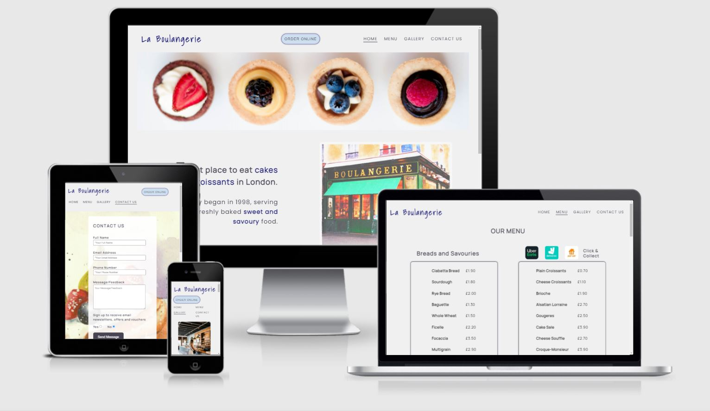

***

## About

The La Boulangerie website is based on a fictional bakery business in London. The website’s overall goal is to attract customers to the bakery and to make sales through online ordering. It aims to highlight the unique selling points of the bakery, make ordering easy and convenient, attract new customers, and encourage loyalty among existing customers. 

La Boulangerie began operating in 1998 and is an independent family-run bakery. It sells breads, sweet and savoury baked goods, desserts, cakes, and cold and hot drinks. The bakery prides in providing distinctly tasty food and beverages made from secret family recipes.

The target customers for the bakery are people looking for a wide variety of delicious freshly baked food in a single bakery, made from quality ingredients. Customers have the option to either ‘take away’ their order or there is seating available for customers who want to enjoy their food and/or beverages in the tranquil environment of the bakery. There is also an option to place orders online through popular delivery services – UberEats, Deliveroo, and Just Eat. To add convenience, a ‘click and collect’ service is also available, where customers are able to place orders online and collect it at the bakery.

The website provides a brief introduction to the bakery; information regarding the wide range of products available and prices; ways to order online; social media links; the bakery’s location, contact information (phone number, email address, and a form to send messages), and the business opening and closing days and times.

***

## Index - Table of Contents

* [User Experience (UX)](#user-experience) 
* [Features](#features)
* [Designs](#designs)
* [Technologies Used](#technologies-used)
* [Testing](#testing)
* [Known Bugs](#known-bugs)
* [Deployment](#deployment)
* [Acknowledgements](#credit)

***

## User Experience (UX)

## Strategy
### User Stories

#### Reasons to visit the website

* A user looking for more information regarding the products sold by the bakery and their prices.
* A user wanting to place an order online for delivery or collection.
* A user looking to find out more about the bakery’s ambience and environment.
* A user looking for the bakery’s location.
* A user looking for the opening and closing days and times of the bakery. 
* A user wanting to send a message or provide feedback relevant to the bakery.

#### Aims of the website

* Increase customers
* Inform customers 
* Maintain loyalty among existing customers through encouraging repeat purchase
* Provide information regarding the products sold at the bakery and their prices
* Provide information for bakery location
* Provide information for bakery operating days and hours 
* Provide information to contact the bakery
* Provide information for the bakery’s social media pages

## Scope

#### User expectations
* Being able to easily navigate through the website
* Being able to easily place orders online
* Being able to easily find the menu and price list
* Visually appealing on different screen sizes
* Functions and links to be working as expected
* Information about La Boulangerie bakery
* Contact information, location, and business operating days and times
* Find links to social media pages
* Special promotional offers and discounts

#### First Time Visitor Goals
* To be able to understand the primary purpose of the website and learn about the business.
* To be able to easily place an order for delivery or collection.
* To be able to easily navigate through the website and find content. 
* To be able to easily find a list of all products offered at the bakery and their prices. 
* To be able to find the location and operating days and times of the bakery.

#### Returning Visitor Goals
* To be able to find and view the menu easily and quickly.
* To be able to easily place orders online for delivery or collection.
* To be able to find business operating days and hours.
* To be able to contact the bakery through the contact us form and provide feedback and/or ask questions. 

#### Frequent User Goals
* Sign up for special promotional offers and discounts.
* Create customer account to easily place orders online.

#### As a developer / business, I want to provide
* A simple and easy to navigate website with all functions and links working as expected
* A comprehensive menu with prices
* Information regarding the bakery
* Photos of the bakery and the products sold
* An easy way to contact the bakery
* Information regarding the bakery location and business operating days and hours
* Links to social media pages

## Structure
The website consists of 4 separate pages
* A homepage with a hero-image, a brief about-us section, and a menu section
* A menu page with a list of products and their prices, and links to online ordering options
* A gallery page with photos of inside of the bakery and its products
* A contact us page with a form, a map, address, phone number, and email address for the bakery

***

## Designs

## Surface

### Colour Scheme
The site was created with a very simple colour scheme of shades of blues and greys. It was important to use subtle colours on the site as the images are bright and vibrant. This ensures that the user is not overwhelmed by many and contrasting colours. A colour picker was used on this specific part of the hero image to select the colours:

Four colours were chosen for the colour palette using the website [Canva](http://canva.com/colors). The image below displays the four colours with their HEX, RGB, and CMYK values. HEX values have been used in style.css file to add colours. RGB value has been for white to add opacity. 

* Midnight blue (#191970) – this colour is used for the logo and to highlight certain phrases on the about-us section. It is also used for the box-shadow effect on the ‘Order Online’ button. 

* Grape (#494454) – this colour is used for text on the site. 

* Light blue-grey (#CDDEEE) – this colour is used for the footer background, and the ‘Order Online’ button background. 

* White Smoke (#F0F0F0) – this colour is used for background of the whole site. 

The suitability of these colours for accessibility and readability purposes was checked using the contrast checker tool on the [WebAim](https://webaim.org/resources/contrastchecker/) website. 

The main background colour (#F0F0F0) was checked against the main text colour (#494454). 

The main background colour (#F0F0F0) was checked against the logo and emphasised text colour (#494454).

The footer and 'Order Online' button background colour (#CDDEEE) was checked against the main text colour (#494454).

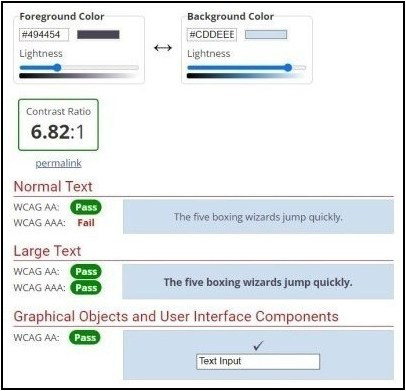

### Typography

Three fonts were imported from [Google Fonts](https://fonts.google.com/) into the style.css file. These include 'Shadows Into Light', 'Poppins', and 'Manrope'.

[Shadows Into Light](https://fonts.google.com/specimen/Shadows+Into+Light?query=shadows+in) – this font was used for the bakery Logo only. This font aims to add style and distinctiveness to the bakery logo. 

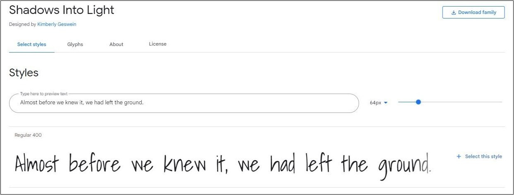

[Poppins](https://fonts.google.com/specimen/Poppins?query=poppins) – this font has been used for all headings on the website.

[Manrope](https://fonts.google.com/specimen/Manrope?query=manrope) – this font has been used for all other text on the website.

* Manrope and Poppins were chosen for headings and other text as they compliment each other and are easily readable. 

* Letter spacing has been included to almost all text to increase readability of the text. 

* All fonts have been set to default to sans-serif in case they are unable to load or be applied to the text. 

* A variety of font sizes have been used throughout the website to ensure text is in proportion to other elements on the page, such as images. 

### Imagery

The main hero-image on the homepage has been included as it provides a simple combination to the bakery’s unique selling points – fresh, unique, prestige and quality. The brightly coloured fruits provide a vibrant energy, while the grey background adds depth to the overall website. 

The remaining images on the website are of paintings and drawings to provide character to the bakery. This also provides consistency of images throughout the website. 

Since La Boulangerie is a fictional bakery, the images on the gallery page were taken from free images websites. However, the idea is that the gallery will include images of the bakery’s outside and inside environment, its products, and its customers. These images will inform the user of the bakery’s ambience, environment, quality and tasty products, and satisfied customers. The gallery page may be updated on a regular basis to introduce new product images and brief descriptions. 

To add style and subtlety throughout the website, the border of all images have been rounded. All images on the website have “alt” attributes. This is to ensure accessibility of the website, and enhance ‘search engine optimisation’. It also ensures there is a description of the image if it fails to load, and screen readers can describe the image to the user. 

#### Image Links

##### Homepage

* [Hero](https://pixabay.com/photos/cupcakes-fruits-dessert-food-1283821/)

* [Bakery](https://pixabay.com/illustrations/watercolor-paris-shops-bakery-5212789/)

* [Bread](https://pixabay.com/illustrations/bread-bakery-food-loaf-sandwich-6713845/)

* [Macarons](https://pixabay.com/illustrations/macarons-dessert-food-nutrition-7059669/)

* [Cake](https://pixabay.com/illustrations/cake-dessert-food-bakery-products-7070335/)

* [Coffee](https://pixabay.com/illustrations/coffee-cup-drink-art-abstract-2368790/)

##### Gallery page

* [Bakery-Woman](https://unsplash.com/photos/_Gd1biLbIU0)

* [Biscuits](https://unsplash.com/photos/upY7FPFfMNo)

* [Bread](https://unsplash.com/photos/IUk1S6n2s0o)

* [Cakes-Display](https://unsplash.com/photos/1WmlAiYgnoI)

* [Cakes](https://unsplash.com/photos/0uBlylsBuWk)

* [Cinnamon-rolls](https://pixabay.com/photos/to-bake-cakes-nut-wreath-pastries-5022110/)

* [Croissants](https://unsplash.com/photos/m9pzwmxm2rk)

* [Cupcakes](https://unsplash.com/photos/FIxdY7jOBus)

* [Donuts-box](https://unsplash.com/photos/c8ovzYe3z0s)

* [Eating-cake](https://unsplash.com/photos/n3Y2_Ohql28)

* [Kitchen](https://unsplash.com/photos/oWtV-CQcs1o)

* [Raisin-cake](https://unsplash.com/photos/29D6U5sZfjk)

* [Savouries-display](https://unsplash.com/photos/R3iAcQxylmE)

* [Shop-inside](https://unsplash.com/photos/RndRFJ1v1kk)

##### Menu

* [Uber-Eats-logo](https://images.app.goo.gl/YGU18qPjAAH8A9nF8)

* [Deliveroo-logo](https://images.app.goo.gl/SdtfqY78zQWdpyNt6)

* [Just-Eat-logo](https://images.app.goo.gl/eCh6si9yZTsrBagK6)

##### Contact Us

* [Pancakes](https://pixabay.com/illustrations/pancakes-strawberry-blueberry-7054658/)

### Logo

The logo was designed using the ‘Shadows Into Light’ font, imported from [Google Fonts](https://fonts.google.com/). This font gives a style and character to the logo to make it distinctive. The colour ‘midnight blue’ (#191970) was selected for the logo using the colour picker on the hero image. 

### Call to Action

The main call to action on the website is the ‘Order Online’ button on the header of every page. This leads the user to the menu page which gives further details on how to make a purchase. The button is designed using the light blue-grey (#CDDEEE) colour as its background, which is the same colour used for the footer background. The corners have been rounded - inline with the images on the website. The button outline colour is midnight-blue (#191970), which is the same colour as the Logo. There is a subtle box-shadow created that further emphasises the button. The text is all uppercase, in the colour grape (#494454), and the font-family is the set to default font Ariel (this font provides the best visibility for this specific feature). There is a hover effect that makes the background colour white on hover. The hover effect enables the user to clearly see that this is a link.

The ‘send message’ button on the contact us page is styled differently to the order online button. This is to ensure there are distinct differences between the two buttons so that they do not cause confusion. The background colour on the ‘send message’ button is grey, with white text. There is a hover effect that changes the background colour to white and the text to grey. 

## Skeleton

### Layout

#### Wireframes

##### Homepage

##### Menu

##### Gallery

##### Contact Us

### Responsiveness

DevTools was used to test and create responsiveness of all pages on the website. This includes desktop screen sizes, laptops, tablets, and smart phones. Media queries have been added at different break-points. 

***

## Features

### Features on all pages

### Header 
The header appears on all four pages of the website and includes the company logo, an 'order online' button and the wesbite navigation bar. The bakery logo is on the left side of the header, which returns to user to the homepage when clicked. There is an ‘order online’ button in the center which enables the user to easily find out how to place an online order. This button is linked to the menu page. The website navigation bar is on the right side of the header, which enables the user to easily move between pages without having to use the ‘back’ function. It includes inks to all four pages of the website: Home, Menu, Gallery, and Contact Us. The header is responsive on multiple screen sizes. The 'order online' button and the navigation bar move to under the logo on small screens, such as tablets and mobile devices. 

### Footer
The footer is featured on all four pages of the website. It is identical on all pages and appears at the bottom of the page. There are three sections included within the footer:

* Opening Times – this section gives information regarding the business opening and closing days and times. This is important as customers need to be aware of when to visit or order online from the bakery. 

* Contact Us – this section lists the bakery phone number, address, and email address. 

* Social Media – this part of the footer provides links to the bakery’s social media platforms – Facebook, Twitter, and Instagram. This encourages the user to stay connected and interact with the bakery. These pages enable the business to advertise the bakery and announce promotional offers, discounts, and events. The social media icons are clickable links to the relevant page which opens in a new tab.  As La Boulangerie is a fictional business, the links currently lead to the social media website homepage.

### Specific Features

### Homepage

#### Image 
The landing page image is a photo of four cupcakes lined up horizontally. It aims to capture the visitors attention and encourage them to investigate further. The vibrant yet subtle colours on the main image, set against a light grey background colour, intend to entice the user to visit or order from the bakery. The fruits on the main image gives the impression of freshness and well-being. 

#### About Us
Set in the middle of the page, this section aims to provide a little information about the bakery. It informs the user that the bakery is based in London and began operating in 1998. The ‘cakes and croissants’ and ‘sweet and savoury’ words have been highlighted in blue (the company logo colour) to place emphasis that the bakery is able to cater for the needs of people wanting to consume either sweet or salty baked goods. The bakery image on the right is a watercolour painting of the bakery from the outside. This aims to give the bakery a character and sense of ‘old-fashioned’ heritage. 

#### Bakery Menu
The bakery menu is located at the bottom of the landing page. It presents four images of different types of products sold at La Boulangerie: Breads and Savouries, Sweets and Desserts, Cakes, and Drinks. Each of the images and product categories link to the relevant part of the section on the main bakery Menu page. There is a hover effect on the bakery category images which aims to add interest in the website. The effect includes the names of the categories set on a white background with an opacity so that the image below is slightly visible on hover. 

### Menu Page

The menu page includes a list of products sold at the bakery and their prices. As La Boulaungerie is a fictional business, the products and prices are invented. The products are presented in four categories: breads and savouries, sweets and desserts, cakes, and beverages. This page has a very simple design layout without any images or colours. This is to ensure the user is able to clearly see the products and price list, without being overwhelmed by images or colours. 

Each product category has two horizontal panels with a list of 10 products on each panel. The category heading is placed on top of the left panel, and options for online ordering are placed on top of the right panel. The online ordering options include icons to popular food delivery services – UberEats, Deliveroo, and Just Eat. These appear next to each product category heading. They are clickable links that open in a new tab. As La Boulangerie is a fictional bakery, the links currently open on the delivery service website homepage. There is also a ‘click & collect’ option included next to the delivery options. This is also a clickable link that directs the user to the contact us page.  

### Gallery Page

The gallery page includes 14 photos relevant to the bakery, presented in a masonry style. This pages aims to give the user an idea of the bakery’s environment and the products sold. Its purpose is to convince the user to visit or order online from the bakery and have an enjoyable experience. The user is able to visualise the bakery and therefore set their expectations accordingly. 

### Contact Us Page

The contact us page includes two panels. There is a background image of pancakes in watercolours. This gives the page a nice touch and adds interest. 

#### Contact Us

The left panel enables the user to complete a short and simple form with their name and contact details, and to send a message to the company. There is also a question that allows the user to either opt-in or opt-out to the mailing list to receive email newsletters, offers and vouchers. The name, phone number, and email address inputs are set to required so that the user is unable to send the message unless these fields have been completed. The message/feedback input field is set to optional. By default, the option to opt-in or opt-out of the mailing list is set to ‘No’. This is to avoid anyone being accidently added to the mailing list if they do not wish to do so. Sending a message will result in the user being informed that their message has been sent and someone will be in contact with them shortly. However, as this website is for educational purposes only, submitting a message currently leads to the formdump.codeinstitute.net page. 

#### How To Find Us

The ‘How to Find Us’ panel is on the right side of the page and includes a google map of the bakery’s location, the bakery address, phone number, and email address. The map includes a ‘View larger map’ link that opens in a new tab where the user can input their own postcode to receive travel instructions to the bakery.

### Future pages and features 

#### Company History

A ‘Company History’ page can be included to provide more information about the company’s history – how it all began and its evolution. This may include a section about the company values, its involvement in the community, and the sourcing of its ingredients. 

#### Cake Orders

A page can be created that enables customers to order cakes for birthdays, weddings, and other special occasions. This may provide the user with an option to choose from a variety of cakes and include a personalised message on the cake. Another option can be included for the user to send a message or call the bakery to discuss any specific needs. 

#### Customer Account

A ‘Customer Account’ page can be added that will enable the customers to login to their account while making purchases online. The ‘Click & Collect’ option can direct the customer to their personal account where they can place orders easily. This may be accompanied with an account card that can be used at the bakery to accumulate points and receive special offers and discounts. 

#### Gallery Page

The gallery page can be further developed to add captions and descriptions of the images.

#### Menu Page

The menu page can be further developed to include images and descriptions of items on sale.

#### Special offers / promotions / events page or feature

A page or feature can be created that includes special offers, promotions, discounts or any events happening at the bakery. 

#### Navigation menu collapses on mobile devices

To assist the navigation menu responsiveness on mobile devices, a feature can be added that collapses the navigation on mobile devices. 

***

## Technologies Used

* HTML5 – used to mark-up the website using semantics
* CSS3 – Cascading Style Sheets was used to create style
* Gitpod.io – creating the website by writing code; creating a progress log by making commits using the command line and pushing to GitHub
* GitHub – create a project repository

#### Design

* [Google Fonts](https://fonts.google.com/)– for styling the typography 
* Balsamiq Wireframe – to create wireframes
* [Font Awesome](https://fontawesome.com/) – for social media icons
* Microsoft Paint 3D – to resize and crop images 

#### Testing 

* [HTML Validator](https://validator.w3.org/) – testing validity of HTML code
* [CSS Validator](https://jigsaw.w3.org/css-validator/) - testing validity of CSS code
* [Am I Responsive](http://ami.responsivedesign.is/#) – checking responsiveness of the site
* [Wave](https://wave.webaim.org/) - checking accessibility of the site
* DEV Tools – Lighthouse check

***

## Testing

The website was tested by the developer, specific testing methods and tools, and other people. This was done to ensure the website is in working order and performs as expected. 

### Checks carried out by the developer

* The navigations links are linked to the corresponding pages and direct the user to the relevant page.
* The logo on each pages directs the user back to the homepage.
* The order online button directs the user to the menu page.
* Bakery menu images and categories direct the user to the relevant section on the menu page.
* Links to online delivery services are working as expected and direct the user to the delivery service website homepage.
* Links to ‘click and collect’ are working and direct the user to the contact us page.
* Contact us form is working as expected. User is unable to send a message without completing all required inputs. 
* The ‘send message’ button directs the user to the relevant message acknowledgement page.
* The google map is working as expected. It opens in a new tab with an option for the user to input their own postcode to receive directions.
* Links are styled to the main grey text colour, and are not blue.
* Hover over effects on all relevant elements are working as expected.
* Social media links are working as expected. They open in a new tab and direct the user to the relevant social media homepage.

### Usability Testing

The website link was sent to a number of family and friends to check its usability. These individuals were given a checklist to carry out the same checks conduced by the website developer. They were asked to also provide feedback on the following aspects of the website: 

* Easy to navigate through the website
* All links are working as expected
* User-friendly design layout
* Ability to find relevant information
* Easy to understand the website content and the business
* Readability and visibility of text and elements on different screen widths and devices
* Any specific comments / feedback regarding the overall experience

All individuals gave positive responses and a few highlighted some issues to be considered: 

* Remove 'order online' button from menu page as it is not necessary. One person thought the link was not working as it was not directing to another page or section. This suggestion has been implemented. 

* The 'click and collect' links direct the user to the contact us page but there are no further instructions given on how to order. This issue has not been resolved as it is not within the scope of the project at this stage. One method of resolving this issue would be to direct the user to a customer account page, where further instructions can be given on how to place an order. Another option is to create another page that gives detailed instructions and options on how the user can place an order, for example - by calling the bakery. 

### HTML Validator

The [W3c Markup Validation Service](https://validator.w3.org/) was used to check the validity of HTML markup of all four pages of the website. The results are displayed below.

Homepage

Menu Page

Gallery Page

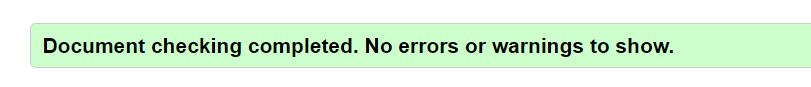

Contact Us Page

### CSS Validator

The [W3c CSS Validation Service](https://jigsaw.w3.org/css-validator/) was used to check the validity of CSS code. The results are displayed below.

### Am I responsive?

The [Am I responsive](http://ami.responsivedesign.is/#) checker was used to test the responsive nature of the website's pages.

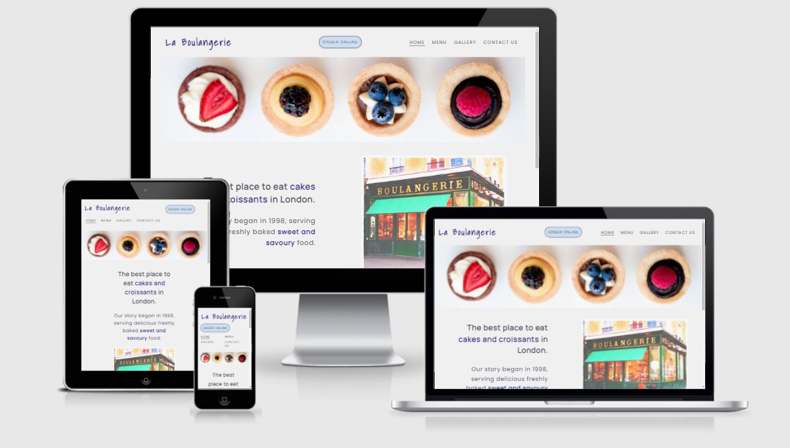

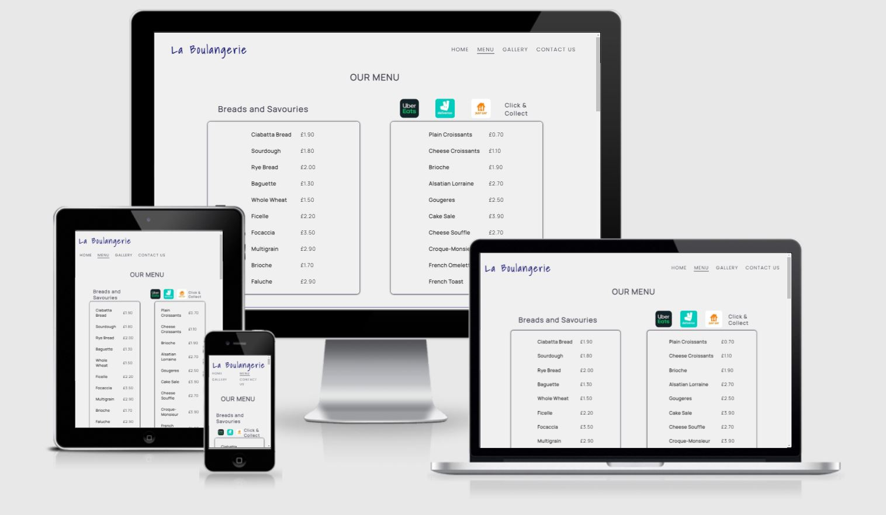

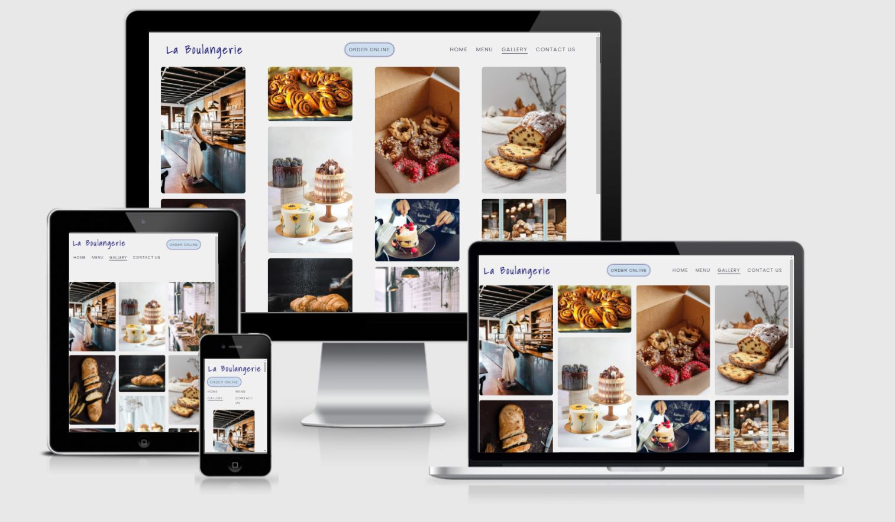

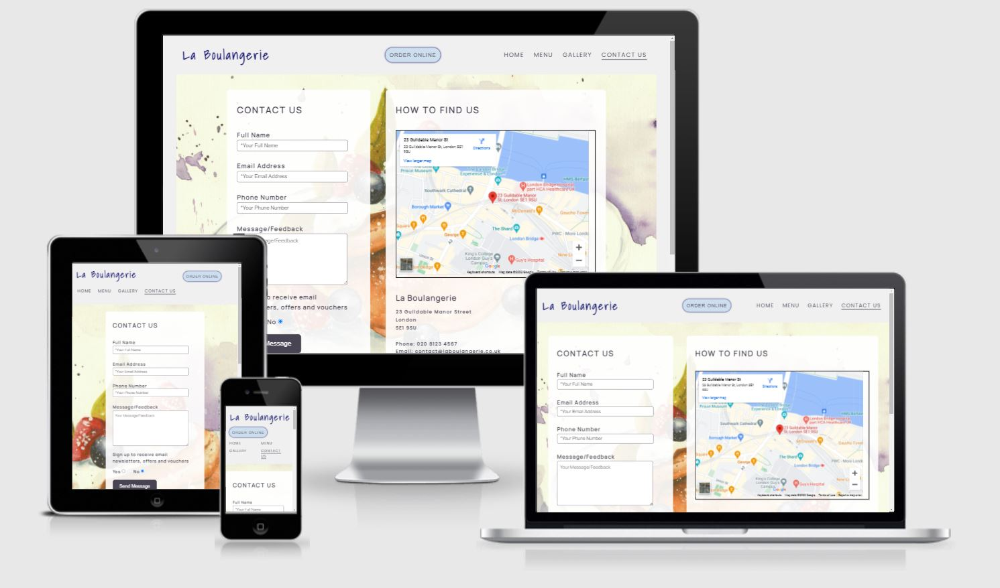

### Lighthouse Test

The Lighthouse Test available on Developer Tools was used to test specific aspects of the website. The tool was used to check the website on desktop and mobile devices. 
The performance score has been inconsistent and gives a different score each time the test is run. Upon further research and suggestions from tutors, it was determined that the Lighthouse performance score is unreliable and will not be considered an important issue with the website. 
The accessibility and SEO scores are 100 on each page. The best practices score is 92 on the homepage because of a low resolution image (bakery-image). However, since the image appears as intended on various screen sizes, this is not considered an important issue to be resolved. 

#### Desktop

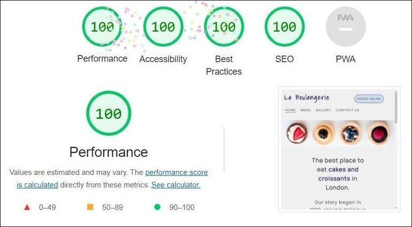

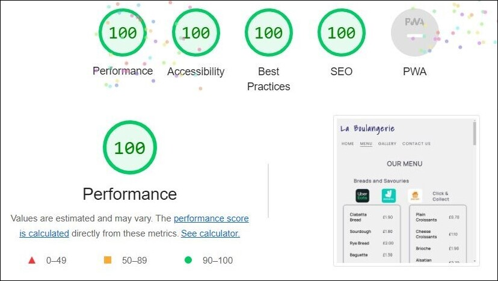

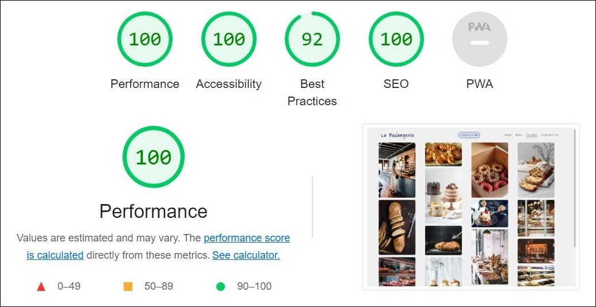

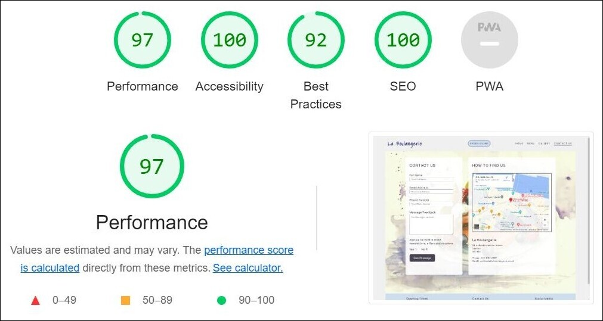

#### Mobile

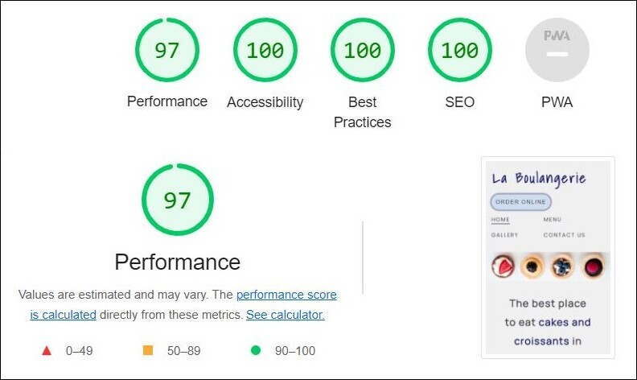

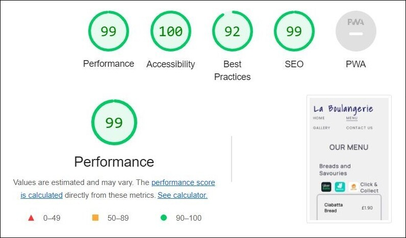

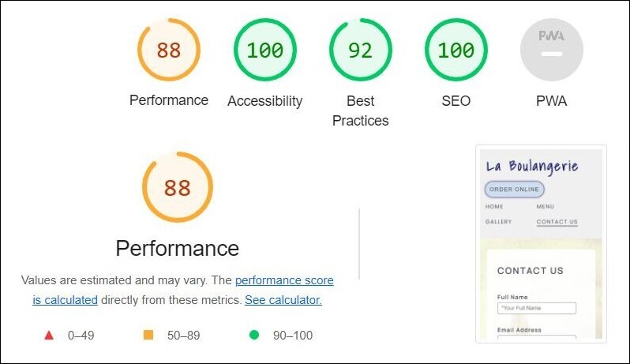

### Wave Test

The Lighthouse test in DevTools gave a 100 score for accessibility of all pages. However, another test was carried out using the [Wave](https://wave.webaim.org/) (Web Accessiblity Evaluation Tool). There is 1 Alert appearing on tests for all pages which refers to the presence of two adjacent links on the header that lead to the homepage - Logo and Home on the navigation bar. Since this is an intentional design element, it is not considered a significant alert to reqiure attention. 

#### Homepage

#### Menu Page

Four of the Alerts on this page refer to the use of the word 'click' in reference to the 'click & collect' links. Upon further research, it was determined that these alerts mainly refer to vague and ambiguous links that ask users to "click here". However, as the links on this page are specific and clear, it is not neccessary to change this aspect. 

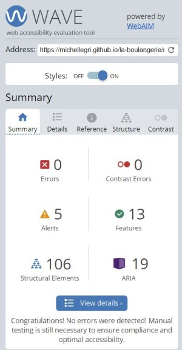

#### Gallery Page 

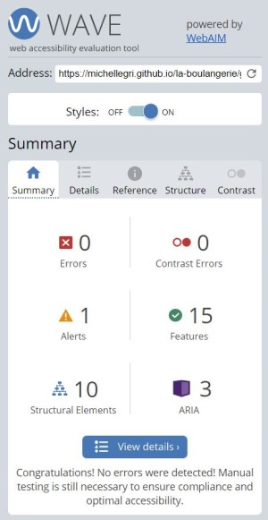

#### Contact Us Page

One of the Alerts on this page refers to the lack of a 'legend' for the radio input field on this page. However, as there are only two options on this field, a legend is not considered necessary. 

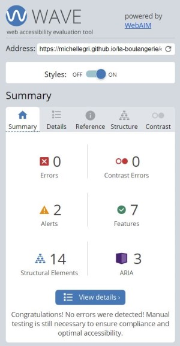

#### Browser Compatibility

The website was tested on Chrome, Firefox, Brave, Internet Explorer, Microsoft Edge, and Safari. It works well with most browsers. 

#### Testing User Stories

***

## Deployment

### Adding and Committing files in GitPod

To add files to the repository:
Type ‘git add .’ in the command line
Type ‘git commit -m “This is the commit message” 
Type ‘git push’

The git commit message should clearly describe the changes made. 

Pushing will send all work to the GitHub repository. 

### Deployment

The steps below were followed to deploy this project:

* Logged into GitHub
* Clicked on the drop-down menu on the right top corner
* Clicked on ‘Your repositories”
* Clicked on the la-boulangerie repository
* Clicked on the Settings tab above the repository
* Clicked on the Pages link on the left side menu
* Under the “Source”, selected None from the dropdown menu and then selected “Master Branch”
* The page refreshed and a link to the deployed website appeared
* Clicked on the link to open the deployed website

## Known Bugs

* The HTML Validation testing revealed that anchor tags are not to be placed before a button element. The bug was fixed by including an ‘onclick’ attribute to the button element. 

* There was no space between the footer and the ‘beverages’ menu section on the menu page. The bug was fixed by adding a margin-bottom to the ‘beverages’ id. 

* Links to specific sections on menu page from the homepage menu sectionwere opening with no space above the category heading. The bug was fixed by adding a padding on top of the headings. 

* There are no other known bugs.

***

## Acknowledgements

### Credit

Brian Macharia - I would like to thank my mentor Brian Macharia for his valuable feedback and suggestions. His guidance enabled me to plan and execute the project. 

Tutor Support – I would like to thank the various tutors at the Code Institute tutor support for assisting me in solving problems and issues. 

#### Media

[Kevin Powell](https://www.youtube.com/kepowob) – YouTube Channel – for providing valuable videos on various HTML and CSS topics, particularly CSS grid and flexbox

[Traversy Media](https://www.youtube.com/c/TraversyMedia) – YouTube Channel – for providing informative videos on various HTMl and CSS topis – particularly CSS grid and flexbox

[Stack Overflow](https://stackoverflow.com/) – for trouble shooting and resolving code issues

[Google Fonts](https://fonts.google.com/) – for fonts used throughout the website

[Google Images](https://www.google.co.uk/imghp?hl=en&ogbl) - for delivery services logos

[Font Awesome](https://fontawesome.com/) – for social media icons

[Canva](https://www.canva.com/) – for choosing a colour scheme

[Pixabay](https://pixabay.com/) - for free images taken from Pixabay

[Unsplash](https://unsplash.com/) - for free images taken from Unsplash

Balsamiq wireframe – for creating wireframes in the design process

[W3school](https://www.w3schools.com/) – for HTML and CSS coding information and trouble shooting

[HTML Validator](https://validator.w3.org/) – for testing validity of HTML code

[CSS Validator](https://jigsaw.w3.org/css-validator/) – for testing validity of CSS code

[Am I Responsive](http://ami.responsivedesign.is/) – for checking responsiveness on different screen sizes

[Wave](https://wave.webaim.org/) - for checking accessibility of the site

***

### Content

Code and Content (not already attributed): Michelle Griffiths

